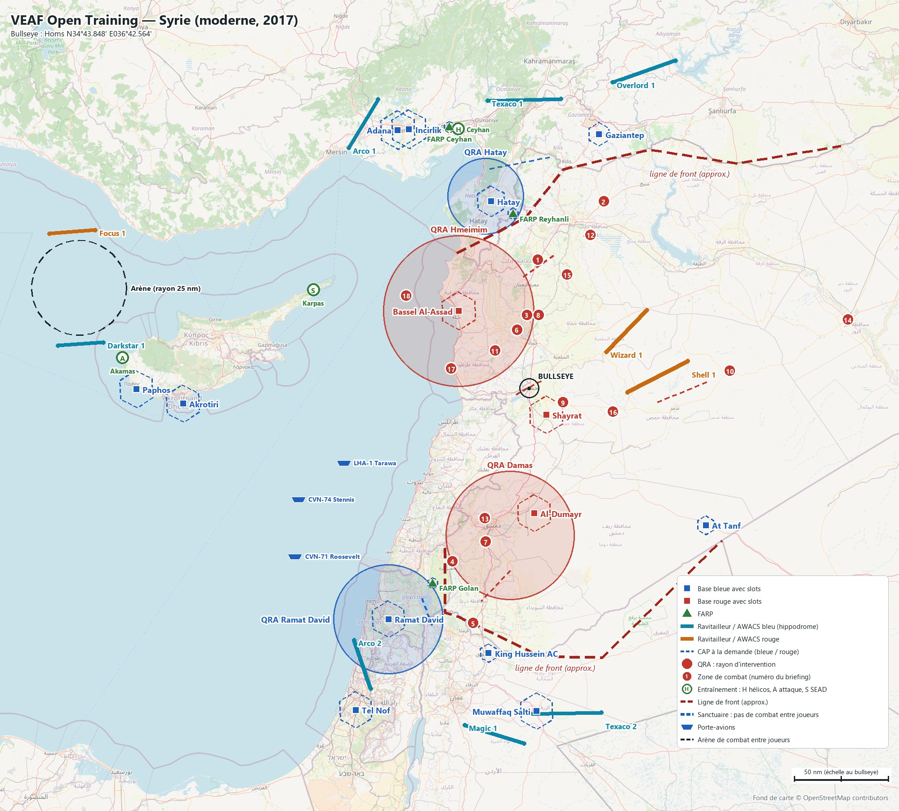
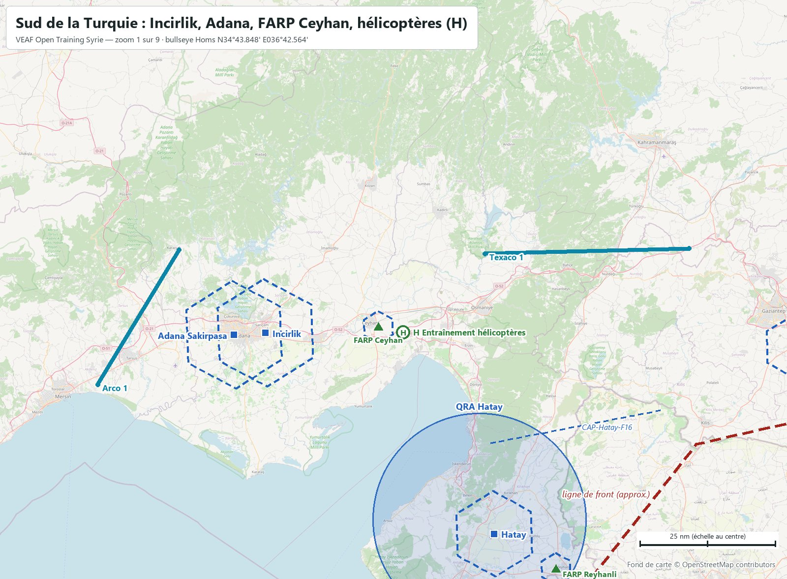
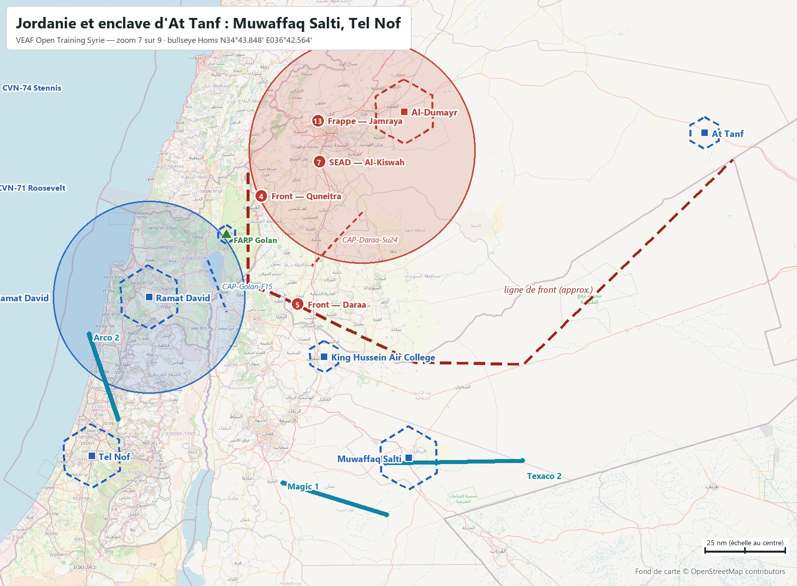
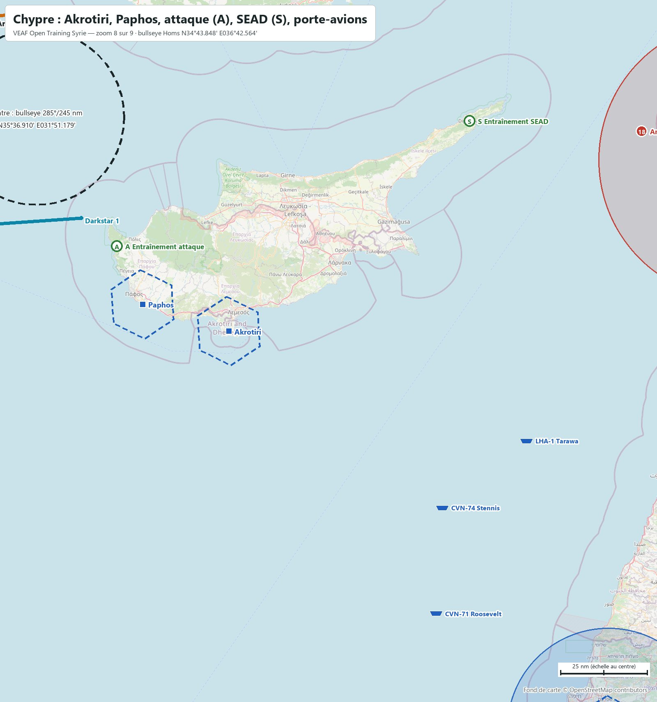
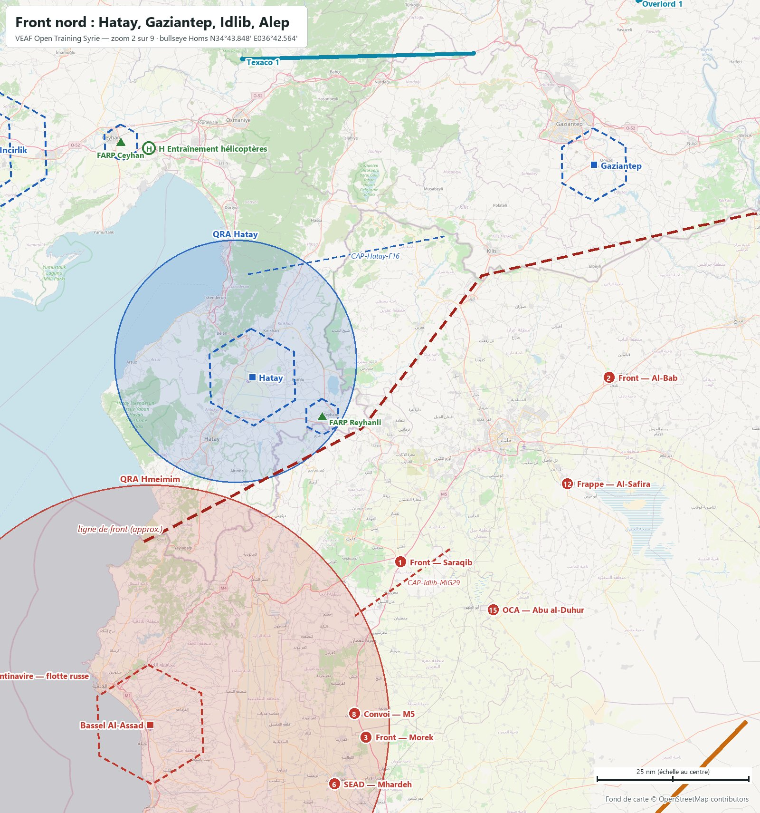
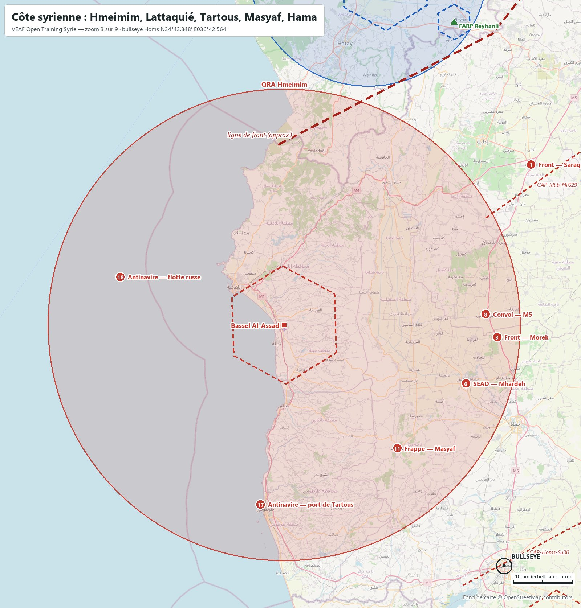
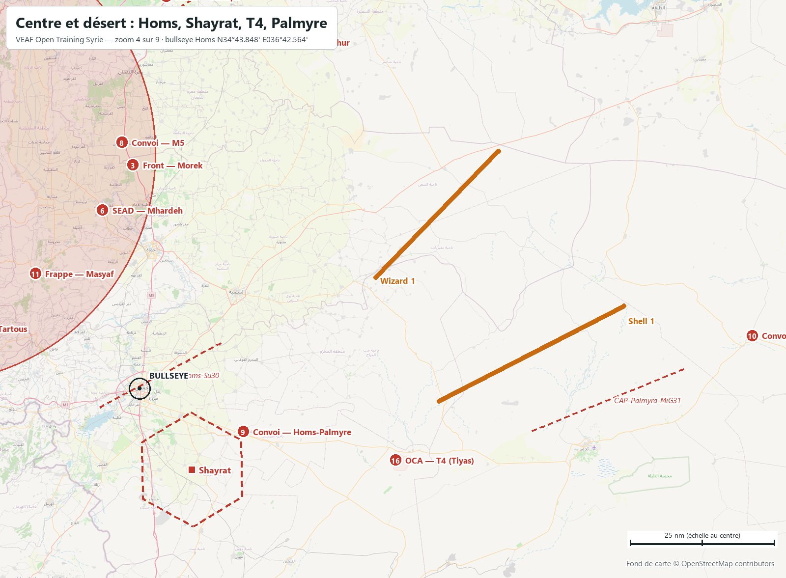
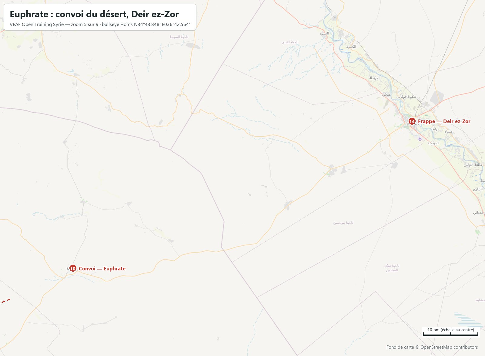
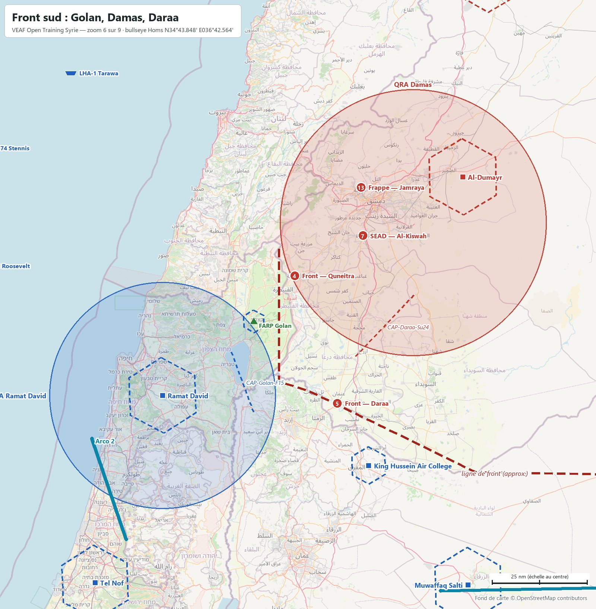
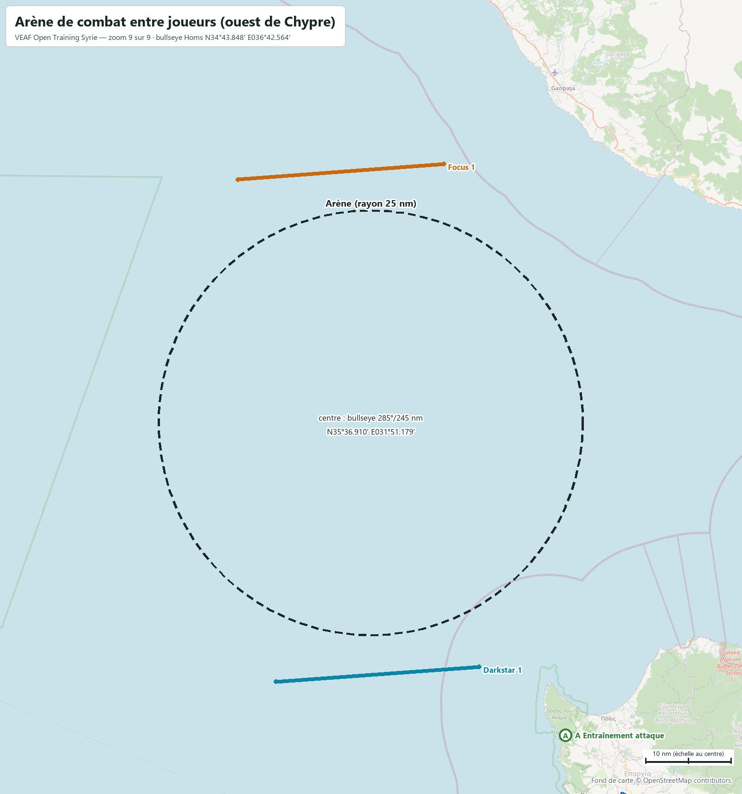

# VEAF Open Training — Syrie (moderne, 2017)

Mission d'entraînement ouverte des serveurs VEAF, sur la carte **Syrie** de DCS, dans un scénario moderne. Ce document est le briefing complet : bases, soutien, zones, QRA, CAP, radio, météo. Les positions sont données en coordonnées (degrés, minutes décimales) et en relèvement/distance depuis le bullseye (relèvement vrai, nautiques).

| Mission | Date | Heure de base | Bullseye (bleu et rouge) | Météo réelle | ATC |
|---|---|---|---|---|---|
| `VEAF_OpenTraining_Syria_ICAO_LTAG` | 15/06/2017 | 08:00 (heure de la carte, UTC+3) | Homs · `N34°43.848' E036°42.564'` | LTAG (Incirlik) | coupé sur tous les aérodromes |

**Sommaire** : [Situation](#situation) · [Carte](#carte) · [Bases](#bases) · [Ravitailleurs et AWACS](#ravitailleurs-et-awacs) · [Porte-avions](#porte-avions) · [Drones laser](#drones-laser) · [Entraînement](#entraînement) · [Zones de combat](#zones-de-combat) · [Missions scénarisées](#missions-scénarisées) · [QRA](#qra) · [CAP à la demande](#cap-à-la-demande) · [Combat entre joueurs](#combat-entre-joueurs) · [Défense aérienne](#défense-aérienne) · [Plan radio](#plan-radio) · [Météo et heures](#météo-et-heures) · [Commandes utiles](#commandes-utiles) · [Pour les créateurs de mission](#pour-les-créateurs-de-mission)

## Situation

La coalition (Turquie, Israël, Jordanie, Royaume-Uni à Chypre, garnison américaine d'At Tanf) fait face au régime syrien et à ses alliés russes. Deux fronts : la frontière turco-syrienne au nord (environ 220 nm), le Golan et la frontière jordanienne au sud (environ 220 nm). Le Liban, le nord de Chypre et l'Irak restent neutres.

Zones de combat, missions et soutien se pilotent par le menu radio F10 (*Zones de combat*, *Missions de combat*, *Assets*).

## Carte



Cartes zoomées, reprises dans les sections qu'elles illustrent : [Sud de la Turquie](docs/cartes/carte_01_cilicie.jpg) · [Front nord](docs/cartes/carte_02_front_nord.jpg) · [Côte syrienne](docs/cartes/carte_03_cote.jpg) · [Centre et désert](docs/cartes/carte_04_centre.jpg) · [Euphrate](docs/cartes/carte_05_euphrate.jpg) · [Front sud](docs/cartes/carte_06_front_sud.jpg) · [Jordanie et enclave d'At Tanf](docs/cartes/carte_07_jordanie.jpg) · [Chypre](docs/cartes/carte_08_chypre.jpg) · [Arène de combat entre joueurs (ouest de Chypre)](docs/cartes/carte_09_arene.jpg).

Carrés : bases avec slots (bleu / rouge). Triangles : FARP. Traits pleins : hippodromes des ravitailleurs et AWACS. Pointillés : CAP à la demande. Cercles pleins : QRA. Pastilles vertes : entraînement (H hélicoptères, A attaque, S SEAD). Pastilles rouges numérotées : zones de combat. Hexagones en tirets : sanctuaires. Navires : porte-avions. Cercle en tirets à l'ouest de Chypre : l'arène. Fond OpenStreetMap ; la ligne de front est approximative. Le briefing DCS montre cette carte puis les zooms (flèches sous l'image, molette pour grossir) ; la carte F10 porte les mêmes dessins, chaque camp ne voyant que les siens.

## Bases

| Base | Camp | Position | Bullseye | UHF | VHF | FM | Défense |
|---|---|---|---|---|---|---|---|
| **Adana Sakirpasa** | Bleu | `N36°59.303' E035°17.493'` | `335°/152 nm` | `251.25` | `121.1` | `39.7` | Hawk + Avenger |
| **Akrotiri** | Bleu | `N34°35.644' E032°58.489'` | `270°/185 nm` | `252.0` | `128.0` | `40.45` | NASAMS + Avenger |
| **At Tanf** | Bleu | `N33°30.387' E038°36.893'` | `128°/120 nm` | `252.9` | `121.1` | `41.35` | NASAMS + Avenger |
| **Gaziantep** | Bleu | `N36°57.107' E037°27.765'` | `017°/138 nm` | `250.1` | `120.1` | `38.5` | Hawk + Avenger |
| **Hatay** | Bleu | `N36°22.276' E036°17.885'` | `350°/100 nm` | `250.3` | `128.5` | `38.7` | Hawk + Avenger |
| **Incirlik** (base mère) | Bleu | `N36°59.655' E035°24.763'` | `337°/150 nm` | `360.1` | `122.1` | `38.75` | Patriot + Hawk + Avenger |
| **King Hussein Air College** | Bleu | `N32°20.928' E036°16.213'` | `190°/144 nm` | `250.45` | `118.3` | `38.9` | Hawk + Avenger |
| **Muwaffaq Salti** | Bleu | `N31°49.150' E036°47.447'` | `180°/174 nm` | `253.15` | `120.5` | `41.6` | Patriot + Hawk + Avenger + Radar d'alerte 1L13 |
| **Paphos** | Bleu | `N34°43.344' E032°28.308'` | `272°/210 nm` | `252.1` | `119.9` | `40.55` | NASAMS + Avenger |
| **Ramat David** | Bleu | `N32°39.465' E035°11.464'` | `213°/146 nm` | `251.3` | `118.6` | `39.75` | Hawk + Avenger + Patriot |
| **Tel Nof** | Bleu | `N31°49.783' E034°50.277'` | `210°/198 nm` | `250.65` | `128.1` | `39.1` | Hawk + Avenger |
| **Al-Dumayr** | Rouge | `N33°36.908' E036°45.804'` | `179°/67 nm` | `253.35` | `120.3` | `41.8` | SA-11 + SA-15 |
| **Bassel Al-Assad** | Rouge | `N35°24.772' E035°56.997'` | `319°/55 nm` | `250.6` | `118.1` | `39.05` | SA-11 + Pantsir (SA-22) |
| **Shayrat** | Rouge | `N34°29.678' E036°53.668'` | `148°/17 nm` | `251.6` | `120.2` | `40.05` | SA-11 + SA-15 |
| **FARP Reyhanli** | Bleu | `N36°15.743' E036°32.198'` | `356°/92 nm` | — | `129.5 AM` | — | dépôt de munitions (CTLD) |
| **FARP Ceyhan** | Bleu | `N37°00.731' E035°50.978'` | `345°/143 nm` | — | `130.5 AM` | — | dépôt de munitions (CTLD) |
| **FARP Golan** | Bleu | `N32°58.998' E035°40.139'` | `208°/117 nm` | — | `130.0 AM` | — | dépôt de munitions (CTLD) |

Slots dynamiques, démarrage moteur chaud, carburant et munitions illimités. Les autres aérodromes de chaque camp lui appartiennent, sans slots. Fréquences : celles que DCS donne à chaque tour (ATC coupé). Adana et At Tanf partagent 121.1 en VHF : c'est la donnée de DCS.

<table><tr><td width="50%"><a href="docs/cartes/carte_01_cilicie.jpg"></a><br><sub>Sud de la Turquie : Incirlik, Adana, FARP Ceyhan, hélicoptères (H)</sub></td><td width="50%"><a href="docs/cartes/carte_07_jordanie.jpg"></a><br><sub>Jordanie et enclave d'At Tanf : Muwaffaq Salti, Tel Nof</sub></td></tr></table>

## Ravitailleurs et AWACS

| Indicatif | Camp | Appareil | Rôle | UHF | TACAN | Niveau | Bullseye (milieu) | Hippodrome (extrémités) | Escorte |
|---|---|---|---|---|---|---|---|---|---|
| **Texaco 1** | Bleu | KC-135 | perche · nord | `290.0` | `50Y` | `FL220` | `000°/151 nm` | `N37°14.323' E036°15.772'`<br>`N37°15.260' E037°03.089'` | oui |
| **Arco 1** | Bleu | KC135MPRS | panier · nord | `291.0` | `51Y` | `FL180` | `330°/164 nm` | `N36°50.055' E034°45.851'`<br>`N37°15.027' E035°04.740'` | oui |
| **Texaco 2** | Bleu | KC-135 | perche · sud | `292.0` | `52Y` | `FL240` | `175°/176 nm` | `N31°47.560' E036°38.807'`<br>`N31°48.329' E037°29.485'` | oui |
| **Arco 2** | Bleu | KC135MPRS | panier · sud | `293.0` | `53Y` | `FL200` | `213°/174 nm` | `N32°28.003' E034°49.301'`<br>`N32°01.316' E035°00.042'` | oui |
| **Overlord 1** | Bleu | E-3A | AWACS · nord | `280.0` | — | `FL300` | `021°/176 nm` | `N37°23.846' E037°36.757'`<br>`N37°35.023' E038°17.323'` | oui |
| **Magic 1** | Bleu | E-3A | AWACS · sud | `281.0` | — | `FL310` | `187°/188 nm` | `N31°41.357' E036°00.997'`<br>`N31°31.334' E036°39.215'` | oui |
| **Darkstar 1** | Bleu | E-3A | AWACS · arène | `283.0` | — | `FL300` | `278°/240 nm` | `N35°08.143' E032°06.860'`<br>`N35°06.404' E031°37.458'` | non |
| **Shell 1** | Rouge | IL-78M | ravitailleur rouge | `294.0` | — | `FL200` | `086°/69 nm` | `N34°41.676' E037°46.106'`<br>`N34°58.198' E038°25.295'` | oui |
| **Wizard 1** | Rouge | A-50 | AWACS rouge | `282.0` | — | `FL300` | `061°/60 nm` | `N35°03.167' E037°32.627'`<br>`N35°25.073' E037°58.669'` | oui |
| **Focus 1** | Rouge | A-50 | AWACS rouge · arène | `284.0` | — | `FL300` | `292°/256 nm` | `N36°07.216' E032°01.738'`<br>`N36°05.413' E031°31.980'` | non |

Les ravitailleurs et AWACS du théâtre sont escortés (paires de F-15C, Su-30 côté rouge). Marqueurs F10 : `-tanker <nom>` amène un ravitailleur au marqueur ; `-tankerlow` et `-tankerhigh` mettent le plus proche au FL120 ou au FL220.

## Porte-avions

| Navire | Position de départ | Bullseye | TACAN | ICLS | Link 4 | Tour | Slots sur le pont |
|---|---|---|---|---|---|---|---|
| **CVN-74 Stennis** (CSG-74 Stennis, 2 escorteurs) | `N33°44.545' E034°13.296'` | `246°/137 nm` | `74X STN` | `11` | `336.0` | `305.0` | 2 × F/A-18C, 2 × F/A-18C, 2 × F-14B |
| **CVN-71 Roosevelt** (CSG-71 Roosevelt, 2 escorteurs) | `N33°13.656' E034°11.132'` | `236°/155 nm` | `71X RSV` | `12` | `337.0` | `306.0` | 2 × F/A-18C, 2 × F/A-18C, 2 × F-14A |
| **LHA-1 Tarawa** (ARG-1 Tarawa, 1 escorteur) | `N34°04.007' E034°42.730'` | `250°/107 nm` | `73X TRW` | `13` | — | `307.0` | 2 × AV-8B, 2 × AV-8B |

En Méditerranée orientale, au large du Liban. Slots à froid sur le pont. Le menu F10 *CARRIER OPS* met chaque porte-avions face au vent, avec son ravitailleur S-3B (Stennis 55Y U295.0, Roosevelt 56Y U296.0) et son hélicoptère de sauvetage.

## Drones laser

| Drone | Appareil | Au-dessus de | Code laser | Radio | Hauteur | Bullseye |
|---|---|---|---|---|---|---|
| **Reaper 1** | MQ-9 Reaper | Ceyhan | `1688` | `36.0 FM` | `3 000 m sol` | `346°/141 nm` |
| **Reaper 2** | MQ-9 Reaper | Akamas | `1687` | `37.0 FM` | `3 000 m sol` | `277°/218 nm` |

Un drone tourne au-dessus des zones d'entraînement hélicoptères (Ceyhan) et attaque (Akamas), et désigne au laser ce qu'il voit. CTLD le maintient à 3 000 m sol : au niveau difficile, l'artillerie antiaérienne lourde de la zone peut l'abattre, et le menu F10 *Assets* le remet en vol. Il ne désigne que des véhicules — ce que sont aussi les cibles des niveaux faciles — et ne marque qu'à 10 km. Pas de drone sur la zone SEAD de Karpas : ses SAM portent plus loin que le laser.

## Entraînement

Loin du front, à quelques minutes d'une base. Trois niveaux par famille, chacun comprenant ceux d'en dessous. **Activez un seul niveau par famille à la fois.** Les cibles des niveaux faciles sont des véhicules immobiles, en tir interdit : chauds au pod, inertes.

<table><tr><td width="50%"><a href="docs/cartes/carte_01_cilicie.jpg"></a><br><sub>Sud de la Turquie : Incirlik, Adana, FARP Ceyhan, hélicoptères (H)</sub></td><td width="50%"><a href="docs/cartes/carte_08_chypre.jpg"></a><br><sub>Chypre : Akrotiri, Paphos, attaque (A), SEAD (S), porte-avions</sub></td></tr></table>

### Hélicoptères — Ceyhan

`N36°59.801' E035°56.746'` · bullseye `346°/141 nm` · rayon 1.1 nm · menu F10 « Entraînement hélicoptères » · Arco 1 (panier, TACAN 51Y, 291.0) à 44 nm ; Texaco 1 (perche, TACAN 50Y, 290.0) à 21 nm

- **H1 Hélico Ceyhan — facile** — Champ de tir hélicoptères à 8 km à l'est du FARP Ceyhan : cibles inertes (blindés et camions immobiles, tir interdit).
- **H2 Hélico Ceyhan — moyen** — Champ de tir hélicoptères de Ceyhan, avec de l'artillerie antiaérienne légère en plus des cibles du niveau facile.
- **H3 Hélico Ceyhan — difficile** — Champ de tir hélicoptères de Ceyhan, avec une défense courte portée réaliste : missiles sol-air à guidage infrarouge et lance-missiles portatifs.

### Attaque — Akamas (Chypre)

`N35°00.082' E032°19.364'` · bullseye `277°/218 nm` · rayon 1.6 nm · menu F10 « Entraînement attaque » · Arco 1 (panier, TACAN 51Y, 291.0) à 162 nm ; Texaco 1 (perche, TACAN 50Y, 290.0) à 234 nm

- **A1 Attaque Akamas — facile** — Champ de tir air-sol sur la péninsule d'Akamas (ouest de Chypre) : blindés et camions immobiles en tir interdit, dépôt et réservoir.
- **A2 Attaque Akamas — moyen** — Champ de tir d'Akamas : une compagnie blindée et de l'artillerie antiaérienne en plus des cibles du niveau facile.
- **A3 Attaque Akamas — difficile** — Champ de tir d'Akamas : un second groupe blindé et une défense sol-air courte portée à guidage radar.

### SEAD — Karpas (Chypre du Nord)

`N35°35.865' E034°22.840'` · bullseye `296°/126 nm` · rayon 2.2 nm · menu F10 « Entraînement SEAD » · Arco 1 (panier, TACAN 51Y, 291.0) à 77 nm ; Texaco 1 (perche, TACAN 50Y, 290.0) à 134 nm

- **S1 SEAD Karpas — facile** — Site SEAD de la péninsule de Karpas : une batterie sol-air moyenne portée seule (SA-6 ou SA-11, tirée au sort).
- **S2 SEAD Karpas — moyen** — Site SEAD de Karpas : la batterie moyenne portée est protégée par une défense courte portée (SA-15, SA-8).
- **S3 SEAD Karpas — difficile** — Site SEAD de Karpas en réseau Skynet : un radar d'alerte avancée guide les batteries, qui restent éteintes jusqu'au dernier moment.

## Zones de combat

Les numéros renvoient à la carte. Chaque zone s'active par le menu F10 *Zones de combat*, qui redonne son briefing et sa position. Une partie des sites change d'une activation à l'autre (batterie tirée au sort, groupes blindés tirés au sort).

<table><tr><td width="50%"><a href="docs/cartes/carte_02_front_nord.jpg"></a><br><sub>Front nord : Hatay, Gaziantep, Idlib, Alep</sub></td><td width="50%"><a href="docs/cartes/carte_03_cote.jpg"></a><br><sub>Côte syrienne : Hmeimim, Lattaquié, Tartous, Masyaf, Hama</sub></td></tr><tr><td width="50%"><a href="docs/cartes/carte_04_centre.jpg"></a><br><sub>Centre et désert : Homs, Shayrat, T4, Palmyre</sub></td><td width="50%"><a href="docs/cartes/carte_05_euphrate.jpg"></a><br><sub>Euphrate : convoi du désert, Deir ez-Zor</sub></td></tr><tr><td width="50%"><a href="docs/cartes/carte_06_front_sud.jpg"></a><br><sub>Front sud : Golan, Damas, Daraa</sub></td></tr></table>

### Front

**Z01 Front — Saraqib** — `N35°51.817' E036°48.188'` · bullseye `005°/68 nm`

Front nord : une brigade mécanisée syrienne tient le carrefour des autoroutes M4 et M5 à Saraqib. Détruire les blindés et l'artillerie ; défense de brigade (artillerie antiaérienne et missiles courte portée). Ravitailleurs : Arco 1 (panier, TACAN 51Y, 291.0) à 115 nm ; Texaco 1 (perche, TACAN 50Y, 290.0) à 83 nm.

**Z02 Front — Al-Bab** — `N36°22.267' E037°30.864'` · bullseye `023°/106 nm`

Front nord-est : des unités syriennes tiennent les abords sud d'Al-Bab. Détruire les blindés et l'infanterie mécanisée ; défense d'artillerie antiaérienne et lance-missiles portatifs. Ravitailleurs : Arco 1 (panier, TACAN 51Y, 291.0) à 129 nm ; Texaco 1 (perche, TACAN 50Y, 290.0) à 57 nm.

**Z03 Front — Morek** — `N35°22.716' E036°41.148'` · bullseye `000°/39 nm`

Front centre : un groupement syrien se masse à Morek, sur l'autoroute M5 au nord de Hama. Détruire les blindés et les lance-roquettes ; défense divisionnaire courte portée. Ravitailleurs : Arco 1 (panier, TACAN 51Y, 291.0) à 128 nm ; Texaco 1 (perche, TACAN 50Y, 290.0) à 112 nm.

**Z04 Front — Quneitra** — `N33°10.998' E035°52.998'` · bullseye `205°/101 nm`

Front sud (Golan) : des blindés syriens se déploient autour de Khan Arnabah, face aux hauteurs du Golan. Détruire les blindés ; défense d'artillerie antiaérienne et lance-missiles portatifs. Ravitailleurs : Arco 2 (panier, TACAN 53Y, 293.0) à 69 nm ; Texaco 2 (perche, TACAN 52Y, 292.0) à 92 nm.

**Z05 Front — Daraa** — `N32°37.367' E036°06.406'` · bullseye `195°/130 nm`

Front sud (frontière jordanienne) : une colonne syrienne se regroupe au nord de Daraa. Détruire les blindés et les camions ; défense d'artillerie antiaérienne. Ravitailleurs : Arco 2 (panier, TACAN 53Y, 293.0) à 65 nm ; Texaco 2 (perche, TACAN 52Y, 292.0) à 57 nm.

### SEAD

**Z06 SEAD — Mhardeh** — `N35°14.880' E036°34.672'` · bullseye `350°/32 nm`

Site sol-air isolé près de Mhardeh, qui couvre la vallée de l'Oronte : une batterie moyenne portée (SA-6 ou SA-11, tirée au sort) et sa défense rapprochée. Ravitailleurs : Arco 1 (panier, TACAN 51Y, 291.0) à 130 nm ; Texaco 1 (perche, TACAN 50Y, 290.0) à 120 nm.

**Z07 SEAD — Al-Kiswah** — `N33°21.516' E036°14.448'` · bullseye `197°/85 nm`

Site sol-air au sud de Damas, près d'Al-Kiswah : une batterie moyenne portée (SA-6 ou SA-11, tirée au sort) protégée par un Pantsir. Ravitailleurs : Arco 2 (panier, TACAN 53Y, 293.0) à 89 nm ; Texaco 2 (perche, TACAN 52Y, 292.0) à 96 nm.

### Convois

**Z08 Convoi — M5** — `N35°26.613' E036°38.786'` · bullseye `357°/43 nm`

Convoi logistique syrien sur l'autoroute M5, de Khan Shaykhun vers Saraqib. L'arrêter avant le front ; il porte sa propre artillerie antiaérienne. Ravitailleurs : Arco 1 (panier, TACAN 51Y, 291.0) à 124 nm ; Texaco 1 (perche, TACAN 50Y, 290.0) à 108 nm.

**Z09 Convoi — Homs-Palmyre** — `N34°36.336' E037°04.536'` · bullseye `114°/20 nm`

Convoi de carburant sur la route de Homs à Palmyre, de Furqlus vers la base T4. Le détruire avant l'arrivée ; il porte sa propre artillerie antiaérienne. Ravitailleurs : Arco 2 (panier, TACAN 53Y, 293.0) à 171 nm ; Texaco 1 (perche, TACAN 50Y, 290.0) à 159 nm.

**Z10 Convoi — Euphrate** — `N34°53.100' E038°52.500'` · bullseye `086°/107 nm`

Convoi de ravitaillement sur la route du désert, d'As-Sukhnah vers Deir ez-Zor. Le détruire en route ; il est escorté par un Tunguska. Ravitailleurs : Arco 1 (panier, TACAN 51Y, 291.0) à 232 nm ; Texaco 1 (perche, TACAN 50Y, 290.0) à 167 nm.

### Frappes en profondeur

**Z11 Frappe — Masyaf** — `N35°03.879' E036°20.448'` · bullseye `319°/27 nm`

Centre de recherche et d'assemblage de missiles sol-sol de Masyaf. Détruire l'état-major, le centre de commandement, le hangar et les lanceurs Scud ; défense SA-15 et artillerie antiaérienne. Ravitailleurs : Arco 1 (panier, TACAN 51Y, 291.0) à 131 nm ; Texaco 1 (perche, TACAN 50Y, 290.0) à 130 nm.

**Z12 Frappe — Al-Safira** — `N36°04.749' E037°22.371'` · bullseye `023°/87 nm`

Complexe militaire d'Al-Safira, au sud-est d'Alep : dépôts de munitions et de carburant. Tout détruire ; défense SA-8 et missiles courte portée. Ravitailleurs : Arco 1 (panier, TACAN 51Y, 291.0) à 131 nm ; Texaco 1 (perche, TACAN 50Y, 290.0) à 72 nm.

**Z13 Frappe — Jamraya** — `N33°34.148' E036°13.865'` · bullseye `200°/74 nm`

Centre de recherche militaire de Jamraya, au nord-ouest de Damas. Détruire les laboratoires, l'état-major et l'antenne ; défense Pantsir, dans la couverture de la défense permanente de Damas. Ravitailleurs : Arco 2 (panier, TACAN 53Y, 293.0) à 97 nm ; Texaco 2 (perche, TACAN 52Y, 292.0) à 108 nm.

**Z14 Frappe — Deir ez-Zor** — `N35°20.280' E040°08.940'` · bullseye `078°/173 nm`

Tête de pont logistique de Deir ez-Zor sur l'Euphrate : dépôts, camions et bunker. Tout détruire ; défense de missiles courte portée. Ravitailleurs : Arco 1 (panier, TACAN 51Y, 291.0) à 271 nm ; Texaco 1 (perche, TACAN 50Y, 290.0) à 189 nm.

### Bases aériennes

**Z15 OCA — Abu al-Duhur** — `N35°43.888' E037°07.128'` · bullseye `020°/63 nm`

Base aérienne d'Abu al-Duhur : MiG-23, Su-24 et hélicoptères au parking. Les détruire au sol ; défense SA-6 et artillerie antiaérienne. Ravitailleurs : Arco 1 (panier, TACAN 51Y, 291.0) à 132 nm ; Texaco 1 (perche, TACAN 50Y, 290.0) à 91 nm.

**Z16 OCA — T4 (Tiyas)** — `N34°31.364' E037°36.869'` · bullseye `107°/47 nm`

Base aérienne T4 (Tiyas), en plein désert : avions d'attaque et hélicoptères au parking, abri et centre de commandement. Défense Pantsir et SA-15, dans la couverture d'un SA-6 permanent. Ravitailleurs : Arco 2 (panier, TACAN 53Y, 293.0) à 187 nm ; Texaco 2 (perche, TACAN 52Y, 292.0) à 163 nm.

### Antinavire

**Z17 Antinavire — port de Tartous** — `N34°54.344' E035°52.130'` · bullseye `286°/43 nm`

Base navale russe de Tartous : deux sous-marins, un pétrolier, un bâtiment de débarquement et un cargo à quai, une vedette de patrouille. Les couler ; le port est sous la défense permanente de Tartous (SA-10, Pantsir). Ravitailleurs : Arco 1 (panier, TACAN 51Y, 291.0) à 128 nm ; Texaco 1 (perche, TACAN 50Y, 290.0) à 141 nm.

**Z18 Antinavire — flotte russe** — `N35°32.897' E035°23.053'` · bullseye `309°/82 nm`

Groupe naval russe en patrouille au large de Lattaquié : un croiseur Moskva et trois frégates. Les couler ; le croiseur porte une défense sol-air de longue portée navale, à attaquer hors de son enveloppe. Ravitailleurs : Arco 1 (panier, TACAN 51Y, 291.0) à 83 nm ; Texaco 1 (perche, TACAN 50Y, 290.0) à 110 nm.

## Missions scénarisées

- **Escorte — ravitaillement d'At Tanf** — Un C-130 décolle de Jordanie vers l'enclave d'At Tanf avec du ravitaillement. Une paire de MiG-29S venue de Damas l'attend sur la frontière. Escortez-le jusqu'à l'atterrissage. Échec si le C-130 est abattu (constaté par vous : la mission ne le vérifie pas).
- **Escorte — raid F-15E sur Al-Safira** — Deux F-15E partent du sud de la Turquie bombarder le complexe d'Al-Safira (zone Z12). Des Su-30 patrouillent sur Alep. Escortez les F-15E jusqu'à la cible et au retour. Activez la zone Z12 si vous voulez voir les dépôts détruits.
- **Interception — raid de Tu-22M3 sur Incirlik** — Deux Tu-22M3 escortés de Su-30 partent du centre de la Syrie bombarder Incirlik par le nord d'Alep. Interceptez-les avant le largage.
- **Interception — transport VIP de Damas à Hmeimim** — Un IL-76 transporte une délégation de Damas vers la base russe de Hmeimim, escorté par deux MiG-29S. Interceptez-le avant l'atterrissage : la route passe à l'ouest de Homs, dans la couverture des défenses permanentes.

À lancer par le menu F10 *Missions de combat*. Elles n'ont pas de condition de réussite automatique : ce sont les pilotes qui jugent.

## QRA

| QRA | Défend | Centre | Bullseye | Rayon | Base | Réponse |
|---|---|---|---|---|---|---|
| **QRA Hmeimim** | Rouge | `N35°24.772' E035°56.997'` | `319°/55 nm` | `40 nm` | Bassel Al-Assad | dès 1 intrus : 1 vol parmi 2 × MiG-29S, 2 × Su-27<br>dès 3 intrus : 1 vol parmi 2 × Su-30, 2 × MiG-31 |
| **QRA Damas** | Rouge | `N33°24.921' E036°30.255'` | `189°/79 nm` | `35 nm` | Mezzeh | dès 1 intrus : 1 vol parmi 2 × MiG-23MLD, 2 × MiG-29S<br>dès 3 intrus : 1 vol parmi 2 × MiG-25PD, 2 × MiG-29S |
| **QRA Hatay** | Bleu | `N36°24.901' E036°14.449'` | `349°/103 nm` | `20 nm` | Hatay | dès 1 intrus : 1 vol parmi 2 × F-16C bl.50, 2 × F-4E-45MC<br>dès 3 intrus : 1 vol parmi 2 × F-16C bl.50, 2 × F-15C |
| **QRA Ramat David** | Bleu | `N32°39.465' E035°11.464'` | `213°/146 nm` | `30 nm` | Ramat David | dès 1 intrus : 1 vol parmi 2 × F-16C bl.50, 2 × F-15C<br>dès 3 intrus : 1 vol parmi 2 × F-15C, 2 × F-16C bl.50 |

Les chasseurs décollent 90 s après l'entrée du premier intrus dans le cercle ; les hélicoptères ne les déclenchent pas.

Couloirs sans QRA rouge : le centre (Homs, Hama) et le désert (Palmyre, T4, l'Euphrate).

## CAP à la demande

| Mission | Camp | Appareils | Niveau | Bullseye (milieu) | Description |
|---|---|---|---|---|---|
| **CAP bleue F-16 (Fox 3) — Hatay — FL220** | Bleu | 2 × F-16C (IA) | `FL220` | `359°/118 nm` | Deux F-16C turcs patrouillent au nord de la frontière, entre Hatay et Gaziantep, au FL220. Emport : AIM-120C*4, AIM-9M*2, Fuel. |
| **CAP bleue F-15 (Fox 3) — Golan — FL250** | Bleu | 2 × F-15C | `FL250` | `206°/133 nm` | Deux F-15C israéliens patrouillent à l'ouest du Golan, au FL250. Emport : AIM-9*4,AIM-120*4,Fuel*3. |
| **CAP rouge Su-30 (Fox 3) — Homs — FL250** | Rouge | 2 × Su-30 | `FL250` | `058°/4 nm` | Deux Su-30 armés de R-77 patrouillent au-dessus de Homs, au FL250. Emport : R-73*4,R-77*6. |
| **CAP rouge MiG-31 (intercepteur haut et rapide) — Palmyre — FL400** | Rouge | 2 × MiG-31 | `FL400` | `092°/82 nm` | Deux MiG-31 patrouillent haut et vite au-dessus du désert de Palmyre, au FL400. Emport : R-40T*2,R-33*4. |
| **CAP rouge MiG-29 (Fox 1) — Idlib — FL220** | Rouge | 2 × MiG-29S | `FL220` | `006°/65 nm` | Deux MiG-29S armés de R-27R et R-60M patrouillent au-dessus d'Idlib, entre Saraqib et la vallée de l'Oronte, au FL220. Emport : R-60M*4,R-27R*2. |
| **Raid rouge Su-24 à intercepter — Daraa — FL120** | Rouge | 2 × Su-24M | `FL120` | `191°/108 nm` | Deux Su-24M chargés de bombes tournent au nord de Daraa, au FL120, prêts à frapper le front sud : les intercepter. Emport : FAB-500*4,R-60M*2. |

À lancer par le menu F10 *Missions de combat*.

## Combat entre joueurs

Des joueurs volent des deux côtés. Le combat entre joueurs est **permis sur le théâtre et dans l'arène, interdit dans les sanctuaires** : un hexagone autour de chaque base et FARP avec slots. Un pilote du camp adverse y est prévenu dès l'entrée, puis détruit au bout de 60 s, et les missiles tirés sur un appareil qui s'y trouve sont détruits. Les limites sont tracées sur la carte F10.

| Sanctuaire | Protège | Centre (bullseye) |
|---|---|---|
| Incirlik | Bleu | `337°/150 nm` |
| Adana Sakirpasa | Bleu | `335°/152 nm` |
| Hatay | Bleu | `350°/100 nm` |
| Gaziantep | Bleu | `017°/138 nm` |
| Ramat David | Bleu | `213°/146 nm` |
| Tel Nof | Bleu | `210°/198 nm` |
| Muwaffaq Salti | Bleu | `180°/174 nm` |
| King Hussein Air College | Bleu | `190°/144 nm` |
| Akrotiri | Bleu | `270°/185 nm` |
| Paphos | Bleu | `272°/210 nm` |
| At Tanf | Bleu | `128°/120 nm` |
| FARP Reyhanli | Bleu | `356°/92 nm` |
| FARP Golan | Bleu | `208°/117 nm` |
| FARP Ceyhan | Bleu | `345°/143 nm` |
| Bassel Al-Assad | Rouge | `319°/55 nm` |
| Shayrat | Rouge | `148°/17 nm` |
| Al-Dumayr | Rouge | `179°/67 nm` |

### Arène

Au-dessus de la mer, à l'ouest de Chypre, loin du théâtre : `N35°36.910' E031°51.179'` · bullseye `285°/245 nm` · rayon 25 nm. Slots en départ en vol, bleus au sud, rouges au nord, face à face.



| Camp | Missiles | Slots | Départ |
|---|---|---|---|
| Bleu | Fox 3 | F-16C ×2, F/A-18C ×2 | `FL200` |
| Bleu | Fox 1 | M-2000C ×2, F-4E ×2 | `FL200` |
| Rouge | Fox 3 | JF-17 ×2, MiG-29S ×2 | `FL200` |
| Rouge | Fox 1 | Su-27 ×2, MiG-21bis ×2 | `FL200` |

AWACS de l'arène : Darkstar 1 (E-3A, bleu) U283.0, FL300 ; Focus 1 (A-50, rouge) U284.0, FL300.

## Défense aérienne

Défense permanente des deux camps : courte et moyenne portée sur chaque base avec slots, quelques batteries longue portée, des radars d'alerte avancée. Aucune ne couvre une base adverse avec slots (portées DCS). Chaque zone de combat a en plus sa propre défense, décrite dans sa fiche.

**Bleu** :

| Site | Système | Position | Bullseye |
|---|---|---|---|
| At-MR | NASAMS | `N33°31.743' E038°37.856'` | `128°/120 nm` |
| At-SR | Avenger | `N33°29.411' E038°36.122'` | `129°/120 nm` |
| Incirlik-LR | Patriot | `N36°57.567' E035°27.218'` | `337°/147 nm` |
| Muwaffaq-LR | Patriot | `N31°47.024' E036°49.715'` | `179°/177 nm` |
| Incirlik-MR | Hawk | `N37°01.035' E035°25.709'` | `337°/151 nm` |
| Incirlik-SR | Avenger | `N36°58.659' E035°24.001'` | `336°/149 nm` |
| Adana-MR | Hawk | `N37°00.684' E035°18.437'` | `335°/153 nm` |
| Adana-SR | Avenger | `N36°58.306' E035°16.733'` | `334°/151 nm` |
| Hatay-MR | Hawk | `N36°23.650' E036°18.841'` | `350°/102 nm` |
| Hatay-SR | Avenger | `N36°21.286' E036°17.118'` | `349°/100 nm` |
| Gaziantep-MR | Hawk | `N36°58.471' E037°28.748'` | `017°/140 nm` |
| Gaziantep-SR | Avenger | `N36°56.123' E037°26.976'` | `016°/137 nm` |
| EWR Maras | Radar d'alerte 1L13 | `N37°24.274' E036°52.689'` | `004°/160 nm` |
| Akrotiri-MR | NASAMS | `N34°37.038' E032°59.368'` | `270°/184 nm` |
| Akrotiri-SR | Avenger | `N34°34.637' E032°57.779'` | `270°/186 nm` |
| Paphos-MR | NASAMS | `N34°44.740' E032°29.179'` | `273°/209 nm` |
| Paphos-SR | Avenger | `N34°44.511' E032°28.458'` | `273°/210 nm` |
| EWR Troodos | Radar d'alerte 1L13 | `N34°48.820' E033°10.673'` | `274°/175 nm` |
| Ramat-MR | Hawk | `N32°40.844' E035°12.365'` | `213°/144 nm` |
| Ramat-SR | Avenger | `N32°38.469' E035°10.740'` | `213°/147 nm` |
| Tel-MR | Hawk | `N31°51.164' E034°51.165'` | `210°/196 nm` |
| Tel-SR | Avenger | `N31°48.786' E034°49.562'` | `210°/199 nm` |
| Ramat-LR | Patriot | `N32°37.372' E035°13.790'` | `212°/146 nm` |
| EWR Carmel | Radar d'alerte 1L13 | `N32°44.854' E035°08.990'` | `215°/142 nm` |
| Muwaffaq-MR | Hawk | `N31°50.519' E036°48.365'` | `180°/173 nm` |
| Muwaffaq-SR | Avenger | `N31°48.163' E036°46.710'` | `180°/175 nm` |
| King-MR | Hawk | `N32°22.300' E036°17.128'` | `190°/143 nm` |
| King-SR | Avenger | `N32°19.938' E036°15.478'` | `190°/145 nm` |
| EWR Azraq | Radar d'alerte 1L13 | `N31°53.193' E036°51.348'` | `179°/171 nm` |

**Rouge** :

| Site | Système | Position | Bullseye |
|---|---|---|---|
| Bassel-MR | SA-11 | `N35°26.156' E035°58.266'` | `321°/56 nm` |
| Bassel-SR | Pantsir (SA-22) | `N35°23.937' E035°56.038'` | `318°/55 nm` |
| Tartus-LR | SA-10 | `N34°53.818' E035°56.941'` | `286°/39 nm` |
| Latakia-EWR | Radar d'alerte 55G6 | `N35°35.010' E036°00.686'` | `328°/62 nm` |
| Shayrat-MR | SA-11 | `N34°31.053' E036°54.940'` | `143°/16 nm` |
| Shayrat-SR | SA-15 | `N34°28.850' E036°52.709'` | `152°/17 nm` |
| AlDumayr-MR | SA-11 | `N33°38.283' E036°47.062'` | `178°/66 nm` |
| AlDumayr-SR | SA-15 | `N33°36.079' E036°44.856'` | `180°/68 nm` |
| DamascusEast-LR | SA-10 | `N33°40.339' E036°51.986'` | `174°/64 nm` |
| Aleppo-MR | SA-11 | `N36°07.869' E037°16.779'` | `020°/88 nm` |
| Hama-MR | SA-6 | `N35°05.651' E036°45.539'` | `008°/22 nm` |
| Tiyas-MR | SA-6 | `N34°32.968' E037°35.208'` | `105°/45 nm` |
| Tartus-SR | Pantsir (SA-22) | `N34°54.603' E035°55.928'` | `287°/40 nm` |
| Hama-EWR | Radar d'alerte 55G6 | `N35°07.993' E036°53.033'` | `021°/26 nm` |
| Palmyra-EWR | Radar d'alerte 55G6 | `N34°33.787' E038°13.692'` | `098°/76 nm` |
| Qasioun-EWR | Radar d'alerte 55G6 | `N33°33.650' E036°14.673'` | `200°/74 nm` |
| Aleppo-EWR | Radar d'alerte 55G6 | `N36°03.654' E037°24.865'` | `025°/87 nm` |
| combatZone_Karpas_Hard-Hard-EWR | Radar d'alerte 55G6 | `N35°34.478' E034°21.928'` | `296°/126 nm` |

## Plan radio

### Bleu

| Radio | Canal | Nom | MHz |
|---|---|---|---|
| Radio 1 (UHF) | `1` | Guard | `243` |
| Radio 1 (UHF) | `10` | Tarawa/73X/ICLS13 | `307.0` |
| Radio 1 (UHF) | `11` | Incirlik / 21X | `360.1` |
| Radio 1 (UHF) | `12` | Adana Sakirpasa | `251.25` |
| Radio 1 (UHF) | `13` | Hatay | `250.3` |
| Radio 1 (UHF) | `14` | Gaziantep | `250.1` |
| Radio 1 (UHF) | `15` | Ramat David / 84X | `251.3` |
| Radio 1 (UHF) | `16` | Tel Nof / 87X | `250.65` |
| Radio 1 (UHF) | `17` | Muwaffaq Salti | `253.15` |
| Radio 1 (UHF) | `18` | King Hussein Air College | `250.45` |
| Radio 1 (UHF) | `19` | Akrotiri / 107X | `252.0` |
| Radio 1 (UHF) | `2` | Overlord 1 AWACS N | `280.0` |
| Radio 1 (UHF) | `20` | At Tanf | `252.9` |
| Radio 1 (UHF) | `3` | Magic 1 AWACS S | `281.0` |
| Radio 1 (UHF) | `4` | Texaco 1/BS/50Y | `290.0` |
| Radio 1 (UHF) | `5` | Arco 1/BM/51Y | `291.0` |
| Radio 1 (UHF) | `6` | Texaco 2/BS/52Y | `292.0` |
| Radio 1 (UHF) | `7` | Arco 2/BM/53Y | `293.0` |
| Radio 1 (UHF) | `8` | Stennis/74X/ICLS11 | `305.0` |
| Radio 1 (UHF) | `9` | Roosevelt/71X/ICLS12 | `306.0` |
| Radio 2 (V/UHF) | `1` | Guard | `121.5` |
| Radio 2 (V/UHF) | `10` | Blade | `135.8` |
| Radio 2 (V/UHF) | `11` | Gordon | `135.9` |
| Radio 2 (V/UHF) | `12` | S-3B Stennis/55Y | `295.0` |
| Radio 2 (V/UHF) | `13` | S-3B Roosevelt/56Y | `296.0` |
| Radio 2 (V/UHF) | `14` | Darkstar 1 Arène | `283.0` |
| Radio 2 (V/UHF) | `15` | FARP Reyhanli | `129.5` |
| Radio 2 (V/UHF) | `16` | FARP Golan | `130.0` |
| Radio 2 (V/UHF) | `17` | FARP Ceyhan | `130.5` |
| Radio 2 (V/UHF) | `18` | Paphos / 79X | `119.9` |
| Radio 2 (V/UHF) | `2` | Archer | `135.0` |
| Radio 2 (V/UHF) | `3` | Arctic | `135.1` |
| Radio 2 (V/UHF) | `4` | Astro | `135.2` |
| Radio 2 (V/UHF) | `5` | Nickel | `135.3` |
| Radio 2 (V/UHF) | `6` | Nitro | `135.4` |
| Radio 2 (V/UHF) | `7` | Ninja | `135.5` |
| Radio 2 (V/UHF) | `8` | Pinder | `135.6` |
| Radio 2 (V/UHF) | `9` | Bengal | `135.7` |

### Rouge

| Radio | Canal | Nom | MHz |
|---|---|---|---|
| Radio 1 (UHF) | `1` | Guard | `243` |
| Radio 1 (UHF) | `2` | Wizard 1 AWACS | `282.0` |
| Radio 1 (UHF) | `3` | Shell 1 IL-78 | `294.0` |
| Radio 1 (UHF) | `4` | Focus 1 Arène | `284.0` |
| Radio 1 (UHF) | `5` | Bassel Al-Assad | `250.6` |
| Radio 1 (UHF) | `6` | Shayrat | `251.6` |
| Radio 1 (UHF) | `7` | Al-Dumayr | `253.35` |
| Radio 2 (V/UHF) | `1` | Guard | `121.5` |
| Radio 2 (V/UHF) | `10` | Al-Dumayr | `120.3` |
| Radio 2 (V/UHF) | `2` | Berkut | `136.0` |
| Radio 2 (V/UHF) | `3` | Sokol | `136.1` |
| Radio 2 (V/UHF) | `4` | Strizh | `136.2` |
| Radio 2 (V/UHF) | `5` | Orel | `136.3` |
| Radio 2 (V/UHF) | `6` | Yastreb | `136.4` |
| Radio 2 (V/UHF) | `7` | Grach | `136.5` |
| Radio 2 (V/UHF) | `8` | Bassel Al-Assad | `118.1` |
| Radio 2 (V/UHF) | `9` | Shayrat | `120.2` |

Préréglages injectés dans les appareils à radio programmable. FM : canaux 1 à 30 = 30 à 59 MHz. Les canaux VEAF sont hors de la bande des tours de Syrie (UHF 243-260, VHF 118-134.6).

## Météo et heures

| Variante | Heure | Météo | METAR |
|---|---|---|---|
| `night-real` | `02:00` | réelle (LTAG) | — |
| `dawn-real` | `sunrise-15*60` | réelle (LTAG) | — |
| `dawn-real-clear` | `sunrise-15*60` | réelle (LTAG), plafonnée VFR | — |
| `dawn-scattered` | `sunrise-15*60` | manuelle | `METAR LTAG 150900Z 25010KT 9999 SCT080 26/12 Q1013` |
| `dawn-rain` | `sunrise-15*60` | manuelle | `METAR LTAG 150900Z 23016KT 8000 RA OVC040 19/15 Q1008` |
| `morning-real` | `sunrise+60*60` | réelle (LTAG) | — |
| `morning-real-clear` | `sunrise+60*60` | réelle (LTAG), plafonnée VFR | — |
| `morning-scattered` | `sunrise+60*60` | manuelle | `METAR LTAG 150900Z 25010KT 9999 SCT080 26/12 Q1013` |
| `morning-rain` | `sunrise+60*60` | manuelle | `METAR LTAG 150900Z 23016KT 8000 RA OVC040 19/15 Q1008` |
| `day-real` | `13:00` | réelle (LTAG) | — |
| `day-real-clear` | `13:00` | réelle (LTAG), plafonnée VFR | — |
| `day-scattered` | `13:00` | manuelle | `METAR LTAG 150900Z 25010KT 9999 SCT080 26/12 Q1013` |
| `day-rain` | `13:00` | manuelle | `METAR LTAG 150900Z 23016KT 8000 RA OVC040 19/15 Q1008` |
| `evening-real` | `sunset-45*60` | réelle (LTAG) | — |
| `evening-real-clear` | `sunset-45*60` | réelle (LTAG), plafonnée VFR | — |

Sur le serveur VEAF, la météo réelle d'Incirlik est appliquée au lancement (RealWeather). Aube = 15 min avant le lever du soleil, matin = 1 h après, soir = 45 min avant le coucher.

## Commandes utiles

- `-tanker <nom>` : amène le ravitailleur nommé à la position du marqueur ; `-tankerlow` / `-tankerhigh` : FL120 / FL220.
- `-cas` : fait apparaître une cible CAS aléatoire au marqueur.
- `-point <nom>` : nomme un point de la carte.
- `-smoke`, `-light`, `-signal` : fumigène, éclairage, fusée.
- `-jtac`, `-afac` : JTAC au sol, drone AFAC.

## Pour les créateurs de mission

Construite de zéro le 02/10/2026 avec VEAF Mission Creation Tools (`veaf-tools`) et le serveur MCP `veaf-mission-mcp`,
d'après le prompt Open Training de VMCT, en s'inspirant de l'Open Training Syrie v5 (`VEAF-Open-Training-Mission-Syria`)
sans la recopier : bases, QRA, CAP et esprit repris ; Damas et le Liban, bleus en v5, rendus au régime et à la neutralité.

### Construire

```powershell
# outils et scripts VEAF installés par l'updater (veaf-tools.exe + published/, hors dépôt)
.\veaf-tools.exe validate

# configuration serveur : sécurité active, logs info, 15 variantes météo dans missions/
.\veaf-tools.exe build

# essais sur un poste : sécurité coupée, logs debug, noms de groupes lisibles, pas de variantes
.\veaf-tools.exe build --profile LOCAL_TEST
```

Mission de test locale (game master, A-10C II en slot classique au sol moteur chaud à Incirlik, pont dcs-bridge) :
`tools/make_test_mission.py` → `bridge/bridge-Syria-OT.miz`. Les slots dynamiques ne marchent qu'en multijoueur.

### Fichiers

| Fichier | Rôle |
|---|---|
| `mission.yaml` | Identité, sécurité, profil `LOCAL_TEST`, modules, zones (niveaux imbriqués par `includes:`), QRA, CAP, missions scénarisées, actifs, sanctuaires |
| `src/mission/` | La mission DCS éclatée (groupes, zones de déclenchement, aérodromes, dessins F10, briefing) |
| `src/presets.yaml` | Plan radio bleu et rouge ; canaux d'aérodromes aux fréquences que DCS donne aux tours |
| `src/versions.yaml` | Variantes météo et heure (METAR réel de LTAG, dégagé, épars, pluie) |
| `src/waypoints.yaml` | Points de navigation injectés dans les appareils joueurs |
| `src/warehouses.yaml` | Bases qui offrent des slots (`exclude_airports` pour les autres), carburant et munitions illimités |
| `src/dynamic-slot-templates.yaml` | Appareils proposés en slots dynamiques, de l'époque seulement (WW2 et premiers jets retirés) |
| `docs/carte.jpg`, `docs/cartes/` | La carte de ce briefing et ses zooms (fond OpenStreetMap) ; les mêmes images sont dans `src/mission/l10n/DEFAULT/` pour le briefing DCS, listées côté bleu et neutre seulement |
| `tools/` | Scripts qui lisent la mission et produisent briefing, cartes et contrôles |

### Régénérer ce document

Ce README est **généré depuis la mission**. Après tout changement, depuis le dossier de la mission, avec l'environnement
poetry de VMCT (chemin absolu des scripts : `poetry -C` change de répertoire) :

```powershell
poetry -C ..\VEAF-Mission-Creation-Tools run python "$PWD\tools\gather.py"              # mission -> tools/briefing_data.json
poetry -C ..\VEAF-Mission-Creation-Tools run python "$PWD\tools\sync_zone_briefings.py" # ligne « Position » des briefings de zone
poetry -C ..\VEAF-Mission-Creation-Tools run python "$PWD\tools\gen_briefing.py"        # briefing DCS
poetry -C ..\VEAF-Mission-Creation-Tools run python "$PWD\tools\gen_readme.py"          # ce README, et les cartes (gen_map.py)
poetry -C ..\VEAF-Mission-Creation-Tools run python "$PWD\tools\verify.py"              # contrôles des .miz construits (ligne VERDICT)
```

### Limites connues

- Les placements au sol (statiques, sites sol-air, convois) ne sont pas vérifiés contre le décor de DCS : aucun catalogue
  de terrain dégagé n'existe pour la Syrie. À vérifier en jeu, comme les dessins F10 et l'aspect du ciel.
- Les portées utilisées pour le contrôle des défenses sont le `ThreatRange` de DCS (dump de la base d'unités du 16/11/2025).
- Les missions scénarisées n'ont pas de condition de réussite ou d'échec (le YAML ne sait pas en porter).
- Le menu F10 *Assets* montre aux deux camps les actifs des deux camps.

